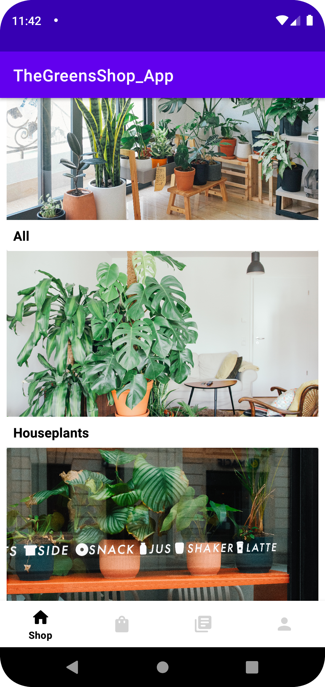
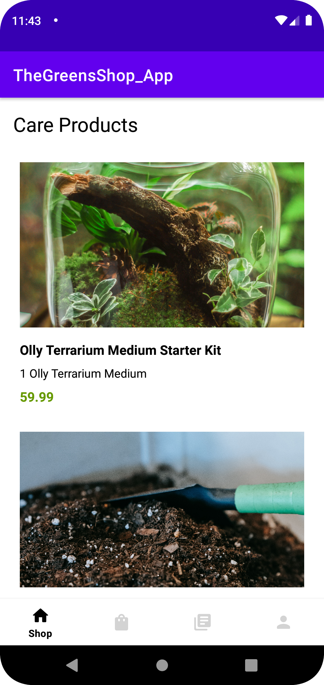

# Mobile Apps 1 Project

- Student Name: Joelma Rodirgues
- Student ID: 24130
- Course: Bsc in Computing  

## Requirement Checklist

- [x] 1. Authentication
  - [x] 1.1. Allow User to Signup
  - [x] 1.2. Log In using username and password
  - [x] 1.3. Store userID once logged in to keep the user logged in (even after restarting the app)
- [x] 2. Product Listing
  - [x] 2.1. List Product Categories
  - [x] 2.2. On clicking a Category, list Products in that Category
  - [ ] 2.3. On clicking a Product, show Product description, show buy button and controls to change quantity.
- [ ] 3. Cart
  - [ ] 3.1. Show cart summary
  - [ ] 3.2. Show total amount
  - [ ] 3.3. Purchase button to place an order, show order notification
- [ ] 4. Show order history
  - [ ] 4.1. List users orders
  - [ ] 4.2. On clicking an Order, show Order details and Products ordered
  - [ ] 4.3. On clicking a Product, take them to Product description page created for 2.3
- [x] 5. Show User details
  - [ ] 5.1. Use the stored userID to show user details
  - [ ] 5.2. Show a random circular profile image
  - [x] 5.3. Show Logout button, on click take back to Signup / Log In page (Restart should not auto login after logout)
- [ ] 6. UI/Implementational Requirements
  - [x] 6.1. RecyclerView used for all Lists: Categories, Products, Orders
  - [x] 6.2. If logged in, attach authentication token to all requests until logout
  - [ ] 6.3. Add a small "About this app" button in the profile page, that shows a page on click with your copyright details and credits
- [x] 7. Bonus
  - [x] 7.1. ViewPager2 with bottom TabLayout for: Shop, Cart, Orders, Profile icons
  - [ ] 7.2. Show a map fragment based on the GPS co-ordinates in the user profile

# The Greens App

The Greens Shop is a plant and accessory shopping app, developed as an academic project to develop skills in programming and interface design. With an intuitive and easy-to-use interface, the app allows users to browse the different product categories, add items to their shopping cart, and purchase products conveniently.

## Report

The projects required throughout the course allowed me to practice the basic skills essential to build an application, progressively increasing the level of complexity. The Mobile App 1 module introduced the most commonly used application functions when programming an Android app, which helped me to have a general idea of how to start developing applications myself. The final project: Online Shopping App, was exciting to work with, despite any obstacles I encountered. Since it is a real-world application, it just elevates the curiosity in the developing process.  

The Greens Shop, the name I chose for my Mobile App 1 project application, was based on a prototype I had in Year 1 for a Continuous Assessment of UX/UI Design & Usability module. The prototype is a Figma design of a plant and accessories online shopping application, perfectly matching the final project requirements.  

Although designing the UI side of the application can be difficult at times, it was while programming the application's behaviour that I had the most demanding challenges. After the deadline, I concluded that a few obstacles could have been avoided if I had made the right APIs and libraries choices to make the app work in the expected way; however, I only know now because I learned from my mistakes.  

One of the most noticeable mistaken choices I want to mention was to use Firebase and Firestore to handle user authentication rather than the fake API, which consumed considerable time. Another mistake was not reusing the Recycler View from the previous Movie App project since it followed the same logic. So I could have saved time, and the time spent debugging those sections of the application could have been used to develop the other requirements, which I had not implemented before in any other project. Despite the hard time I had making the Login and Signup function, I implemented the navigation menu bar, which I believe allows the user to navigate easily through the application making it more user-friendly. 

My general afterthoughts about the final project are that assessments that bring up practical situations make the module more enjoyable, keeping students engaged. I wish I had more time to dedicate to the project and deliver a masterwork, even though the project was released a month before. Even if I understand that is the college's programme schedule, in a full-time course, six modules release projects simultaneously in addition to final exams in the last month of the semester. Nevertheless, if I could add any feedback, is that for the future, perhaps the final project can be released at the beginning of the semester, so the students can implement features to it while being introduced to each topic.  

In conclusion, the Mobile App 1 Final Project was an eye-opener to what can be done with mobile applications. The Greens Shop App will be updated to meet the project's initial requirements during the summer holidays. However, as a personal challenge, I will keep working on it to make a professional application. Moreover, search for new mobile projects as examples of the online shop app to have a solid base for the Mobile Apps 2 Module – Year 3.

## References and Credits
Zoom Meetings: Ramachandran, S. (2023)  
Mobile App 1 - BSC20922 - Semester 2 [Zoom Meetings]  
Dorset College Dublin  

Github Repository: 
Ramachandran, S. (2023). Dorset MobileApps1  
Retrieved from https://github.com/saravanabalagi/dorset_mobileApps1

Image Source: https://unsplash.com/  |  https://www.pexels.com/  
Content Source: https://plnts.com/en  
Icons: https://icons8.com/  |  Apache Library 2.0  

- Reading: 
  - Android Developer [Link here](https://developer.android.com/)
  - Firebase - [Add Firebase to your Android project](https://firebase.google.com/docs/android/setup?hl=en&authuser=0)
  - Firebase Android SDK Release Notes: https://firebase.google.com/support/release-notes/android#appcheck-debug_v17-0-0
  - Namespaces in XML [Link here](https://www.w3.org/TR/1999/REC-xml-names-19990114/#AttributePrefixUnboundandroidx.cardview.widget.CardView&app:cardCornerRadius&app)

- Video Classes and Tutorials: 
  - Stack Mobile - [Projeto Firebase](https://www.youtube.com/playlist?list=PLizN3WA8HR1y0DMrcNIz8sZvzXzRM-WNQ).
  - CodingZest - [Firebase Realtime Database] (https://developer.android.com/reference/android/view/View.OnClickListener).

  
## Screenshots

<table style="border-collapse: collapse;">
  <tr>
    <td style="padding-right: 100px;">
      
    </td>
    <td>
      
    </td>
  </tr>
  <tr>
    <td align="center"><b>Home Screen</b></td>
    <td align="center"><b>Product List</b></td>
  </tr>
</table>

## APK Releases
Download the latest version [here](https://github.com/joelmarodrigues/TheGreensShop_App/releases/tag/greenappv1).

- The Green App v1.1.1  

- Testing features  
To watch a short video demonstrating the features of the app, click [here](https://www.loom.com/share/9f3244ab45a94f0a98fffd90a8108bb8).
